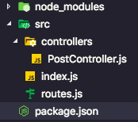
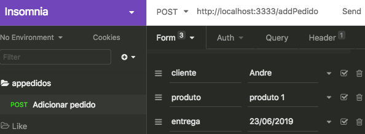
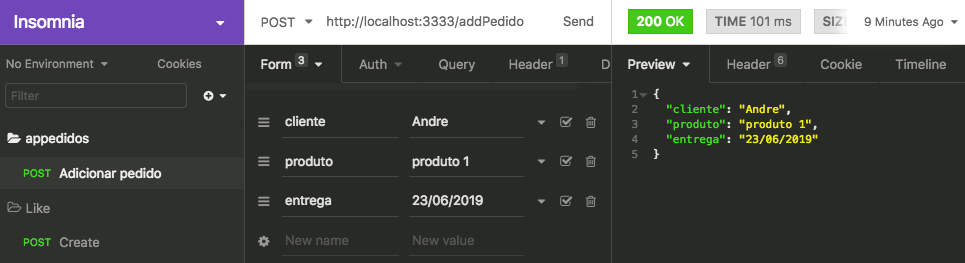
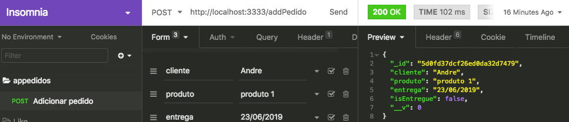
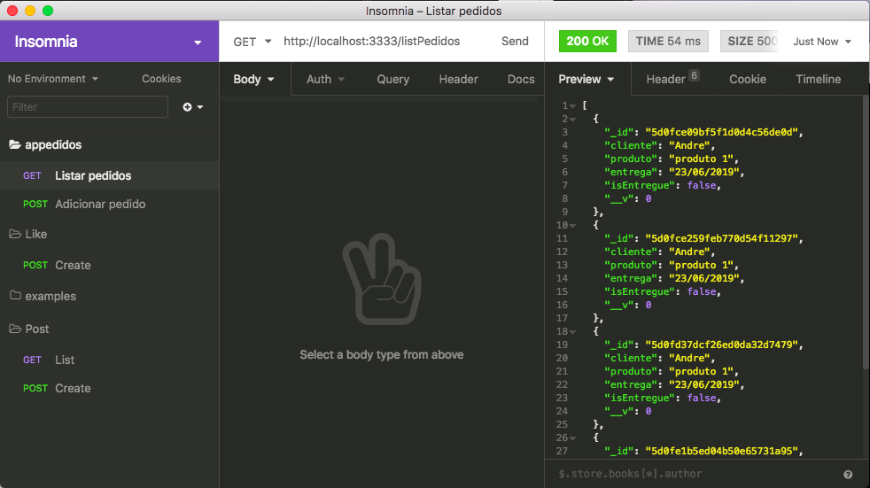
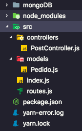

# Pequeno manual introdutório do NodeJS (RESTfull API's)

[TOC]

Este *pequeno manual* foi feito com a finalidade de me auxiliar na criação de backends utilizando nodeJS e, ao mesmo tempo, fixar meu aprendizado. Creio que possa servir de auxílio para outros que, como eu, desejam começar a utilizar o *ecossistema* React (nodeJS, ReactJS, React-Native).

O ambiente de desenvolvimento já deve estar previamente configurado, ou seja, os pacotes [nodeJS](https://nodejs.org), [reactJS](https://reactjs.org) , e [Yarn](https://yarnpkg.com) já devem ter sido instalados.

Para o banco de dados, utilzaremos o [mongoDB](https://www.mongodb.com) por motivos a serem explicados mais à frente. Instale-o em sua máquina ou utilize o serviço on-line e gratuito deles [MongoDB Atlas](https://www.mongodb.com/cloud/atlas).

## Início: Configurando esqueleto genérico de uma aplicação

* Crie um diretório chamado `backend`, entre nele e execute:

```bash
$ yarn init -y
```
> Isso irá criar o arquivo `package.json`

Para adicionar pacotes, execute `yarn add nome_do_pacote`. Ele irá automaticamente para a lista de dependências do app, em `package.json`.

Numa aplicação web, um pacote comummento adicionado é o `express`. Ele cria o servidor web e gerencia as requisições e respostas.

```bash
$ yarn add express
```

* Crie um diretório `src` para separar o código fonte dos arquivos gerados automaticamente.

* Crie um arquivo `index.js` como arquivo inicial da aplicação e inicie o servidor com o seguinte código:

```js
const express = require('express');

const app = express();

app.get('/', (req, res) => {
    res.write('Hello World.\n');
    res.end();
})

app.listen(3333);
```

Para iniciar o servidor, basta executar: `$ node src/index.js`. Uma melhor opção, porém, é instalar uma dependência de desenvolvimento (que só é utilizada durante o desenvolvimento do app) chamada `nodemon`:

```bash
$ yarn add nodemon -D
```

No arquivo `packages.json` constará a dependência de desenvolvimento (`devDependencies`) nodemon e sua versão.

* Adicione um novo objeto chamado `scripts` com a variável `dev` igual a `nodemon /src/index.js` no arquivo `packages.json` para cofigurar o `nodemon`. O arquivo `package.json` fica da segunte forma:

```javascript
{
  "name": "backend",
  "version": "1.0.0",
  "main": "index.js",
  "license": "MIT",
  "scripts": {
    "dev": "nodemon src/index.js"
  },
  "dependencies": {
    "express": "^4.17.1"
  },
  "devDependencies": {
    "nodemon": "^1.19.1"
  }
}
```

> Basicamente, o `nodemon` detecta alterações nos arquivos e reinicia automaticamente o servidor, poupando o trabalho de ficar executando `$ node src/index.js` sempre que alguma alteração for feita.

* Inicie o servidor:

```bash
$ yarn dev
```

* No browser, acesse [http://localhost:3333](http://localhost:3333) para visualizar a aplicação.

Para a escalabilidade do app, é interessante lidar com as rotas em um local específico. Crie um arquivo `routes.js` e adicione o código:

```js
const express = require('express');

const routes = new express.Router();

routes.get('/', (req, res) => {
    res.write('Hello from routes!');
    res.end();
});

module.exports = routes;
```

O arquivo `index.js` deverá ser alterado para manter a funcionalidade anterior

```js
const express = require('express');

const app = express();

app.use(require('./routes'));

app.listen(3333);
```

* Verifique se está tudo correto atualizando a página [http://localhost:3333](http://localhost:3333). Você deverá ver o texto `Hello from routes!`.

Novamente visando a escalabilidade, é interessante que as rotas sejam gerenciadas (ou controladas) em um outro local. Assim conseguimos separar o direcionamento das rotas (para onde elas vão) e sua lógica (o que elas fazem).

* Crie um diretório `controllers`, dentro de `src`.

* Crie um arquivo chamado `PostController.js` `dentro de controlers` com o seguinte conteúdo:

```javascript
module.exports = {
    async index(req, res) {
        res.write('Hello from controller!');
        res.end();
    }
}
```

* Modifique o arquivo `routes.js` para agora utilizar o controller:

```javascript
const express = require('express');

const PostController = require('./controllers/PostController');

const routes = new express.Router();

routes.get('/', PostController.index);

module.exports = routes;
```

> O `PostController.js` exporta as funções que serão executadas em cada rota definida em `routes.js`.

* Atualize [http://localhost:3333](http://localhost:3333). Você deverá ver o texto `Hello from controller!`.

Agora podemos começar a desenvolver a aplicação em específico. Para fins de verificação, a estrutura de diretórios deverá estar como a imagem abaixo:



## Desenvolvimento: exemplo de uma aplicação

### Descrição da aplicação

O aplicativo que será aqui desenvolvido é um *gerenciador de pedidos*. Imagine um vendedor autônomo que quer controlar melhor suas vendas e oferecer um melhor serviço aos seus clientes. Ele irá fornecer um endereço web para que os clientes possam fazer pedidos de seus produtos on-line.

Com isso em mente, podemos definir as rotas necessárias ao nosso aplicativo. Elas são referentes às ações que os clients poderão realiar. Duas que imediatamente me vêm à cabeça são:

| Ator | Ação | Rota |
|------|------|------|
| Cliente | Fazer pedido | `/addPedido`|
| Autônomo | Listar pedidos | `/listPedidos` |

Naturalmente, outras ações (e consequentemente rotas) como "Marcar pedido como **entregue**" ou "Cancelar pedido" podem ser adicionadas posteriormente. Agora vamos nos preocupar com essas duas rotas.

### Adicionando rotas
* Modifique os arquivos `PostController.js` e `routes.js` para **adicionar** um novo pedido no banco de dados quando o caminho (rota) for [http://localhost:3333/addPedido](http://localhost:3333/addPedido).

**PostController.js**
```javascript
module.exports = {
    async index(req, res) {
        res.write('Hello from controller!');
        res.end();
    },

    async adicionar(req, res) {
        console.log('Rota: adicionar pedido');
    }
}
```
**routes.js**
```javascript
routes.get('/', PostController.index);
routes.post('/addPedido', PostController.adicionar);
```

> OBS.: Iremos trabalhar com um banco de dados não-relacional, o [mongoDB](https://www.mongodb.com). Não iremos relacionar uma tabela "pedidos" com uma tabela "usuários", iremos apenas adicionar pedidos. Estou assumindo que o autônomo possui os dados de seus clientes (endereço, telefone etc) e que, pra ele, só os pedidos importam. No futuro, podemos colocar um bando de dados relacional (como o [MySQL](https://www.mysql.com)) para gerenciar nossos pedidos.

Ao acessar [http://localhost:3333/addPedido](http://localhost:3333/addPedido), o browser nos retorna algo como `Cannot GET /addPedido` por dois motivos: (a) não estamos retornando nada para o browser (através de `res.write()` e `res.end()`); e (b) estamos fazendo uma requisição do tipo `GET`, sendo que nosso controller está esperando uma requisição do tipo `POST`.

Entretanto podemos ver no terminal: `Rota: adicionar pedido` indicando que nosso código está *ok*, estamos conseguindo chamar a função `adicionar` em `PostController.js`.

> Para facilitar o desenvolvimento de nossa API, recomendo a instalação do [Insomnia](https://insomnia.rest). Ele é capaz de fazer qualquer tipo de requisição e, porcaus disso, nos será muito útil.

### Refinando as rotas (definindo a lógica)

Para esse rota específica, a de adicionar um pedido (`/addPedido`), o usuário irá interagir através de um form HTML. Como estamos desenvolvendo a API, o backend, não iremos criar um arquivo HTML com o código que irá gerar o formulário de pedidos. Para gerar essa requisição, utilizaremos o Insomnia.

No Insomnia, crie uma pasta para gerenciar as requisições de nossa aplicação. Chamei a aplicação de **Appedidos** =). Dentro da pasta, crie uma nova requisição de nome "Criar pedido" do tipo "POST" e de body "Form URL Encoded". Crie 3 campos de nomes "cliente", "produto" e "entrega" para se referir ao nome do cliente, ao produto a ser pedido e à data de entrega, respectivamente. Coloque o endereço `http://localhost:3333/addPedido`. Ao final, seu Insomnia deve estar mais ou menos assim:



> Isso vai "emular" o usuário adicionando um novo pedido pelo *frontend*, através de um formulário da página ou pelo aplicativo. Para o *backend*, é só isso que importa.

Vamos utilizar o `mongoose` para nos comunicarmos com o mongoDB. Devemos então adicioná-lo às nossas dependências do app:

```bash
$ yarn add mongoose
```

Para mantermos nosso código enxuto e, mais uma vez, visando a escalabilidade, vamos criar uma pasta `models` onde ficarão os esquemas (schemas) de nosso BD. Os esquemas podem ser entendidos como as tabelas do nosso BD.

Dentro do diretório `models`, crie o arquivo `Pedido.js` e adicione o código para criar o *schema*:

```javascript
const mongoose = require('mongoose');

const PedidoSchema = mongoose.Schema({
    cliente: String,
    produto: String,
    entrega: String,
    isEntregue: Boolean,
});

module.exports = mongoose.model('Pedido', PedidoSchema);
```

> Criamos uma variável to tipo Schema, com os pares `campo: tipo do campo`. O campo **isEntregue** define se o pedido foi entregue ou não e será iniciado com *false*.

Para visualizarmos os dados da requisição do usuário:

**1)** modifique `PostController.js`

```javascript
module.exports = {
    async index(req, res) {
        res.write('Hello from controller!');
        res.end();
    },

    async adicionar(req, res) {
        console.log(req.body);
        return res.json(req.body);
    }
}
```

**2)** Adicione `app.use(express.urlencoded());` ao arquivo `index.js` para reconhecer requisições de formulários:

```javascript
const express = require('express');
const mongoose = require('mongoose');

const app = express();

mongoose.connect('mongodb://localhost:27017/mongoDB', {
    useNewUrlParser: true,
});

app.use(express.urlencoded());
app.use(require('./routes'));

app.listen(3333);
```

**3)** Envie a requisição através do Insomnia, apertando `Send`.

O resultado será algo como:


Você também poderá ver no temrinal:
`{ cliente: 'Andre', produto: 'produto 1', entrega: '23/06/2019' }`

### Adicionando ao Banco de Dados Mongo

> A partir de agora, os códigos-fonte dos arquivos não serão exibidos por completo, mas sim só o código a ser adicionado/alterado juntamente com parte do código para facilitar a localização. As reticências (...) no fim ou começo do bloco de código indicam que há mais código além delas.

Uma vez instalado o mongoDB (ou utilizando o serviço MongoDB Atlas), é preciso informar a aplicação a localização do bancode dados. Para isso adicione ao `index.js`:

```javascript
...
const app = express();

mongoose.connect('mongodb://localhost:27017/mongoDB', {
    useNewUrlParser: true,
});

app.use(express.urlencoded());
...
```

> Caso tenha escolhido insalar o mongoDB na sua máquina, crie uma pasta `mongoDB` dentro de `backend` e, uma pasta `data` dentro de `mongoDB` e inicie o mongoDB, dentro do diretório `backend`, com o comando:
>> $ mongod -dbpath mongoDB/

>  Assim, o caminho mostrado no bloco de código acima funcionará pra você.

Modifique o arquivo `PostController.js` de forma que a função `adicionar` fique da seguinte forma:

```javascript
...
async adicionar(req, res) {
    const {
        cliente,
        produto,
        entrega,
    } = req.body;
    const isEntregue = false;

    const registro = await Pedido.create({
        cliente,
        produto,
        entrega,
        isEntregue,
    });

    return res.json(registro);
},
...
```
 > No primeiro 'bloco', são criadas variáveis para armazenar o conteúdo do form. É criada uma variável para armazenar que o pedido ainda não foi entregue.
 O segundo bloco é o armazenamento no MongoDB em si, através da função create. Lembre-se que Pedido é um *schema* do mongo, definido em `models/Pedido.js`.
 O resultado do armazenamento, chamado de registro, é o que retorna da função. É o que nossa API vai devolver ao *frontend*.

 Podemos ver, através do Insomnia, que o pedido foi armazenado no banco de dados quando ele retorna um `_id`, campo criado automaticamente pelo mongo.



Concluímos a definição de nossa primeira rota. O usuário já pode fazer um pedido ao nosso vendedor autônomo. A aplicação irá armazenar esse pedido que contém o nome do cliente, o produto desejado e a data desejável da entrega. O pedido tem também um campo que não é mostrado ao usuário, que diz se o pedido já foi entregue ou não. Somente o vendedor que poderá visualizar esse campo e alterá-lo.

### Listando os pedidos

Chegou a hora de começarmos a definir uma nova rota: a de listagem de pedidos: `/listPedidos`.

Adicione a nova rota em `routes.js`:

```javascript
...
routes.post('/addPedido', PostController.adicionar);

routes.get('/listPedidos', PostController.listar);
...
```

A função no nosso controller foi chamada de `listar`. Devemos criá-la, então, em `PostController.js`:

```javascript
...
async listar(req, res) {
    const pedidos = await Pedido.find();

    return res.json(pedidos);
},
```

> Não esqueça de adicionar uma vírgula (`,`) após a chave de fechamento da função anterior.

> Lembre-se, novamente, que `Pedidos` é um objeto *schema* do mongo, cotendo métodos e propriedades. Utilizamos o método `find()` para listar todos os registros. Poderíamos colocar filtros como nome do cliente, mas no nosso caso a listagem é completa, sem filtros.

Para testar a rota `/listPedidos` podemos utilizar o próprio navegador, já que é uma rota do tipo GET, acessando [http://localhost:3333/listPedidos](http://localhost:3333/listPedidos). Porém, vamos utilizar o Insomnia criando uma nova requisição GET de nome `Listar pedidos`. Após digitar o endereço [http://localhost:3333/listPedidos](http://localhost:3333/listPedidos) e pressionar `Send`, um resultado como o seguinte deve aparecer:



Pronto! Concluímos as duas rotas que definimos no início do desenvolvimento da aplicação. Vários recursos foram vistos neste exercício e há muito espaço para melhoramentos. Um mais urgente é adicionar uma nova rota para que o vendedor possa marcar um pedido como entregue e ele suma da lista de pedidos. Outro seria a possibilidade de visualizar os pedidos já entregues, ordenar por cliente, etc.

Caso algo sobre a estrutura dos diretórios não tenha ficado muito claro, assim deverá ficar a estrutura final:



O próximo manual será sobre desenvolver um *frontend* utilizando ReactJS.

