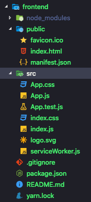
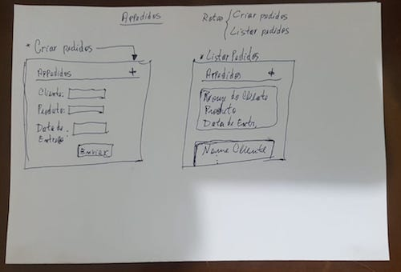
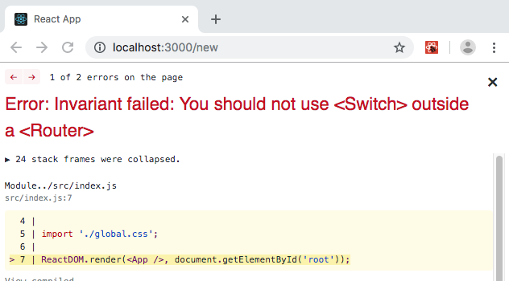
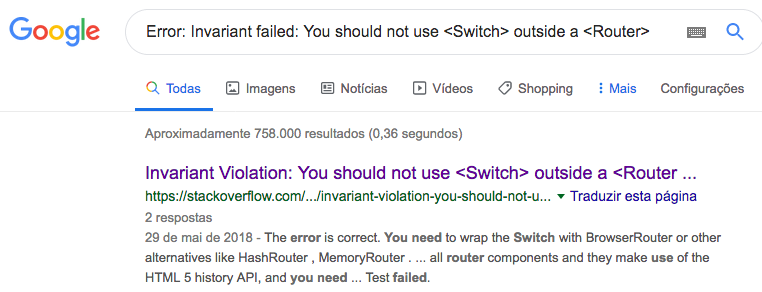

# Pequeno manual introdutório do ReactJS

Dando continuidade à construção da aplicação **appedidos**, vamos construir o nosso *frontend* utilizando ReactJS.

## Iniciando o projeto

Para iniciar o projeto, execute:

```bash
$ yarn create react-app frontend
```

Uma estrutura de diretórios como a da figura abaixo será criada.



Inicie o mongo, dentro da pasta `backend`:

```bash
$ mongod -dbpath mongoDB/
```

Inicie o *backend*, dentro da pasta `backend`:

```bash
$ yarn dev
```

Inicie o *frontend*, dentro da pasta `frontend`:

```bash
$ yarn start
```

Acesse [http://localhost:3000](http://localhost:3000) (se já não houver automaticamente iniciado) acessar o página padrão do frontend com o logo do React.

## Compreendendo a estrutura de arquivos

Um arquivo package.json, bem parecido com o que temos no *backend*, foi automaticamente criado com algumas dependências e scripts padrão. No *backend* nós criamos o script `dev` para esecutarmos com o `yarn`. Aqui, vários scripts estão criados, incluindo o `start`que utilizamos para iniciar o *frontend*.

A pasta `src` também já aparece aqui por padrão, com alguns arquivos de lógica (`.js`) e de estilo (`.css`), além da logo do react.

O arquivo html que o react utiliza está localizado na pasta `public`. Se você abrí-lo com um editor de texto, verá que dentro da seção `body` tem um `div` com `id="root"`. É dentro dsse div que o react coloca todo o design gerado por ele.

## Construção do esqueleto do *frontend*

Vamos começar excluindo alguns arquivos que não nos são necessários. Da pasta `src`, exclua os arquivos `App.css`, `App.test.js`, `index.css`, `logo.svg` e `serviceWorker.js`. Restarão apenas os arquivos `App.js` e `index.js`.

Modifique o arquivo `index.js` para que fique como o abaixo:

```js
import React from 'react';
import ReactDOM from 'react-dom';
import App from './App';

ReactDOM.render(<App />, document.getElementById('root'));
```

Modifique também o `App.js`:

```js
import React from 'react';

function App() {
  return (
    <div className="App">
      <h1>Hello World.</h1>
    </div>
  );
}

export default App;
```

O browser deve ter recarregado a página e você está vendo o famoso Hello World.

### Básico sobre o funcionamento do React

> Vale observar que, como você que lê, eu também estou aprendendo e tudo isso é mais um exercício para mim do que uma tentativa de explicar as coisas com 100% de acurácia. No meio do texto, vou deixando links para leitura complementar que recomendo fortemente que sejam lidos.

O que acontece para que essa frase seja mostrada no navegador é basicamente: O arquivo `src/index.js` é executado e, juntamente com a importação do react e do react-dom, o arquivo `App.js` é importado. A linha seguinte, basicamente, coloca tudo o que for retornado pela função `App()` em `App.js` dentro daquele `div` com `id="root"` do arquivo `public/index.html`. No caso, o que `App()` retorna é um `div` contendo um `h1` que contém o texto `Hello World.`. Em outras palavras, o texto `Hello World` foi renderizado através de um componente.

De maneira simples, podemos entender por componente um arquivo javascript (`.js`) que tem por finalidade retornar um conteúdo JSX. No nosso exemplo o conteúdo [JSX](https://jsx.github.io/) que está sendo retornado pela função `App()` é o código html:

```html
<div className="App">
  <h1>Hello World.</h1>
</div>
```

O componente pode ser um [função](https://developer.mozilla.org/pt-BR/docs/Web/JavaScript/Reference/Operators/function) (como no nosso caso) ou pode ser uma [classe](https://developer.mozilla.org/pt-BR/docs/Web/JavaScript/Reference/Classes), e pode também ser interpretado como um pedaço de código que podemos "isolar" da nossa aplicação. Por exemplo, o cabeçalho de nossa página pode ser um componente, isto é, uma parte de código que não vai interessar nada ao restante de nossa aplicação. Assim, um componente pode conter código estrutural (*html*), código de estilização (*css*) e código de lógica (*javascript*), todos ao mesmo tempo.

## Desenvolvimento do *frontend* específico

> Eu sugiro ao leitor que, ao invés de copiar o colar o código, escreva cada linha, cada palavra e cada letra dos códigos que aqui serão exibidos. Dessa forma você se dá mais tempo para ler o código em si, entender como ele funciona e ainda ajuda a criar uma memória muscular da sintaxe.

Nesse ponto, a aplicação já deve ter o design definido para que ele possa ser implementado. O design pode ser feito em programas como Photoshop, Corel ou inDesign. Eu fiz o meu numa folha de papel mesmo:



As telas compartilham de um mesmo cabeçalho que contém apenas o nome (e futuramente uma logo) da aplicação no lado esquerdo e, no lado direito, um botão de '+'. Esses itens servirão para acessar nossas duas páginas, a de listar pedidos e a de adicionar pedidos, respectivamente.

O corpo da aplicação vai ser modificado de acordo com a página e ser visualizada. A página de adicionar pedidos terá um formulário html com os campos necessários à criação do pedido. A página de listar os pedidos terá '*cards*' com os dados de cada pedido.

Vamos tentar chegar o mais perto possível do design imaginado.

Crie um arquivo `global.css` em `src`. Esse arquivo irá conter a estilização geral da nossa aplicação e faça a importação dele no arquivo `index.js`.

```js
...
import App from './App';

import './global.css';

ReactDOM.render(<App />, document.getElementById('root'));
```

Modifique o arquivo `global.css` para que contenha as seguintes definições de estilo:

```css
* {
    margin: 0;
    padding: 0;
    outline: 0;
    box-sizing: border-box;
}

body {
    background: #fafafa;
    font: 14px Arial, Helvetica, sans-serif;
    -webkit-font-smoothing: antialiased !important;
}
```

### Rotas

Assim como no *backend* em nodeJS, nosso *frontend* em reactJS terá diferentes rotas. Como definido no [pequeno manual nodeJS](../backend/README.md), a aplicação tem duas rotas principais: adicionar pedidos (cliente) e listar pedidos (vendedor). Então teremos duas páginas, uma pra cada rota.

Em `src` crie a pasta `pages` e adicione dois arquivos: `Pedidos.js` e `New.js`. Esses são os componentes que retornarão as páginas necessárias às nossas rotas.

Vamos utilizar os componentes em formato de classe para retornar o conteúdo JSX, que no caso é um `<h1>` que identifica a página. Modifique o arquivo `Pedido.js`:

```js
import React, { Component } from 'react';;

class Pedido extends Component {
    render() {
        return (
            <h1>Pedido</h1>
        );
    }
}

export default Pedido;
```

> O método render() é o responsável pelo retorno do conteúdo JSX pela nossa classe. Ele é obrigatório.

Faça o mesmo com o arquivo `New.js` substituindo *Pedidos* por *New*:

```js
import React, { Component } from 'react';;

class New extends Component {
    render() {
        return (
            <h1>New</h1>
        );
    }
}

export default New;
```

Para o gerenciamento de rotas no reactiveJS, adicione o pacote `react-router-dom`:

```bash
$ yarn add react-router-dom
```

Crie o arquivo `routes.js` em `src` e adicione o conteúdo:

```js
import React from 'react';
import { Switch, Route } from 'react-router-dom';

import Pedido from './pages/Pedido';
import New from './pages/New';

function Routes() {
    return (
        <Switch>
            <Route path='/' exact component={Pedido} />
            <Route path='/New' component={New} />
        </Switch>
    );
}

export default Routes;

```

> O código em `routes.js` importa o React primeiro porque estamos utilizando código JSX nas rotas, depois as funções necessárias para fazer o roteamento das páginas do módulo `react-router-dom` e, em seguida, importa as nossas duas páginas: `Pedidos.js` e `New.js`. Em seguida, o código exporta um componente em formato de função, o `Routes()`, para retornar as rotas.

<hr />

#### Usando Switch e Route:

O componente `Route` é o que efetivamente vai rotear a aplicação, ligando os endereços (url) aos componentes (páginas). Assim, as rotas, que são retornadas do componente `Routes()`, também são um componente. Então, a primeira rota `/`, vai chamar o componente `Pedido`. Analogamente, a rota `/New` irá acessar o componente `New`.

O `Switch` vai garantir que **apenas** uma rota será chamada a cada url digitada pelo usuário. O `Route` verifica se o *path* está contido na url, e não se ele é único. Por exemplo: a url `/new/teste` contém o *path* `/` e o *path* `/new`, então o `Route` vai tentar direcionar o usuário para as duas rotas. A utilização do `Switch` fará com que as rotas sejam direcionadas para **apenas** a url que é exatamente (**exact**, no código) igual ao *path*. Usando o mesmo exemplo anterior, a url `/new/teste` seria direcionada **apenas** para a rota de path `/new/teste`.

<hr />

Para que as rotas funcionem, importe as rotas no arquivo `App.js` e chame o componente `Routes` que foi criado. O arquivo `App.js` ficará da seguinte forma:

```js
import React from 'react';

import Routes from './routes';

function App() {
  return (
    <Routes />
  );
}

export default App;
```
 > Como foi dito antes, os componentes retornam JSX, que é basicamente html. Quando chamamos o componente `Routes` ele retorna o JSX que vai depender de qual url estiver sendo chamada, substituindo o html estático que retornava apenas `Hello World`.

#### Lidando com erros

Salve todos os arquivos. Você vai perceber que algo deu errado. Uma página de erro como a mostrada abaixo deverá aparecer.



Quando se está programando, mesmo seguindo um guia como esse, alguns problemas podem acontecer. Eu aconselho sempre pegar a mensagem de erro principal, no nosso caso `Error: Invariant failed: You should not use <Switch> outside a <Router>` e fazer uma pesquisa sobre ele. No Google, o primeiro resultado da busca me direcionou para uma página do [stackoverflow](https://stcakoverflow.com) com a explicação para o problema e solução.



> A maioria dos problemas são comuns e resolvidos rapidamente com uma pesquisa no Google. Outros precisam de um pouco mais de atenção e persistência, e somente uma fração deles não são resolvidos através de pesquisa. Nesses casos, sempre vale a pena perguntar nos fóruns e o stackoverflow é um excelente lugar pra isso.

A explicação sobre o problema foi, basicamente: o componente `BrowserRouter` precisa ser importado e colocado em volta dos componentes que precisam ter acesso às rotas.

A solução é, portanto, modificar o `App.js` da seguinte forma:

```js
import React from 'react';
import { BrowserRouter } from 'react-router-dom';

import Routes from './routes';

function App() {
  return (
    <BrowserRouter>
      <Routes />
    </BrowserRouter>
  );
}

export default App;
```
